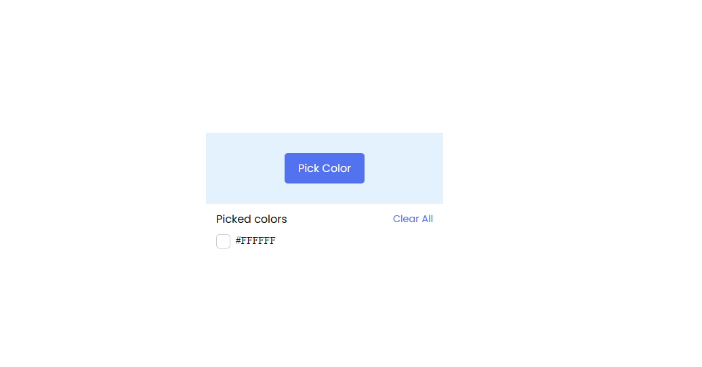
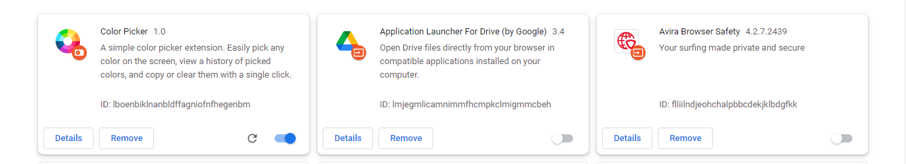
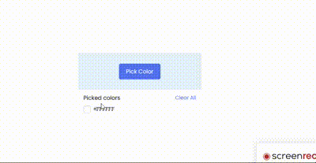

# Steps to Create Color Picker Chrome Extension
We will create a color picker Chrome extension using HTML, CSS, and JavaScript in five simple steps:

1. Setting up the project
2. Creating the extension
3. Creating a manifest file
4. Testing and debugging

# Extension Image

# Working 

# Testing and Debugging
Open Chrome and go to this URL: chrome://extensions.  

Enable the “Developer mode” toggle in the top-right corner of the page.  

Click the “Load unpacked” button and select your extension project directory. 

Your extension should now be loaded and appeared on the Chrome extensions page.
