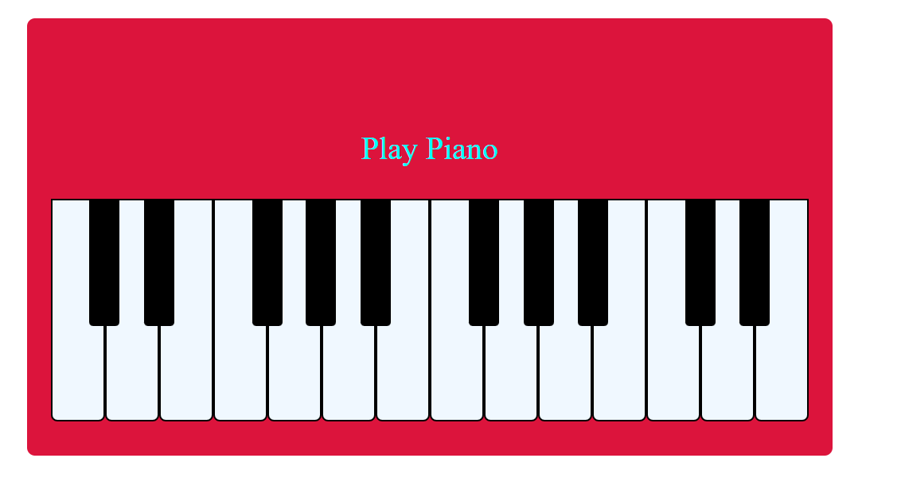

# Piano using Html CSS and JavaScript
This is a piano by using basic concept of html ,css and js.
# Working
The layout is created using basic html and css. In HTML part two "div" are created one for black keys and the other for white one.In JS part,we created a function'sound' for playing the sound,which gets called in a for loop which responds to user click.
## Tech Stack Used
1. HTML
2. CSS
3. Vanilla JS
# Screen Shot

